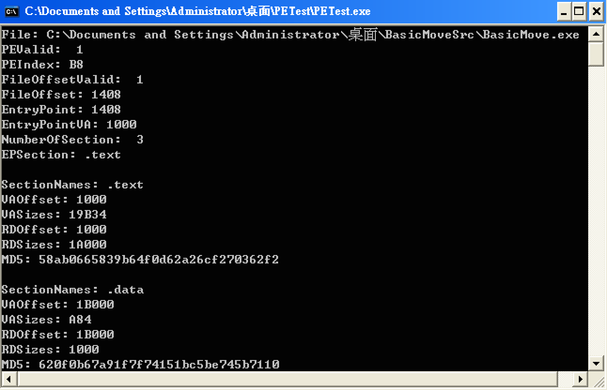

PE-Viewer
=========

A Windows Portable Executable viewer, display PE information, entry point, section information. Created in 2010.
Written in FreeBasic.

Compile
----------
```
fbc PETest.bas
```

Usage
--------------
Drag and Drop target PE file into the compiled PE-Viewer.

Screenshots
-----------



License
----

MIT
    
